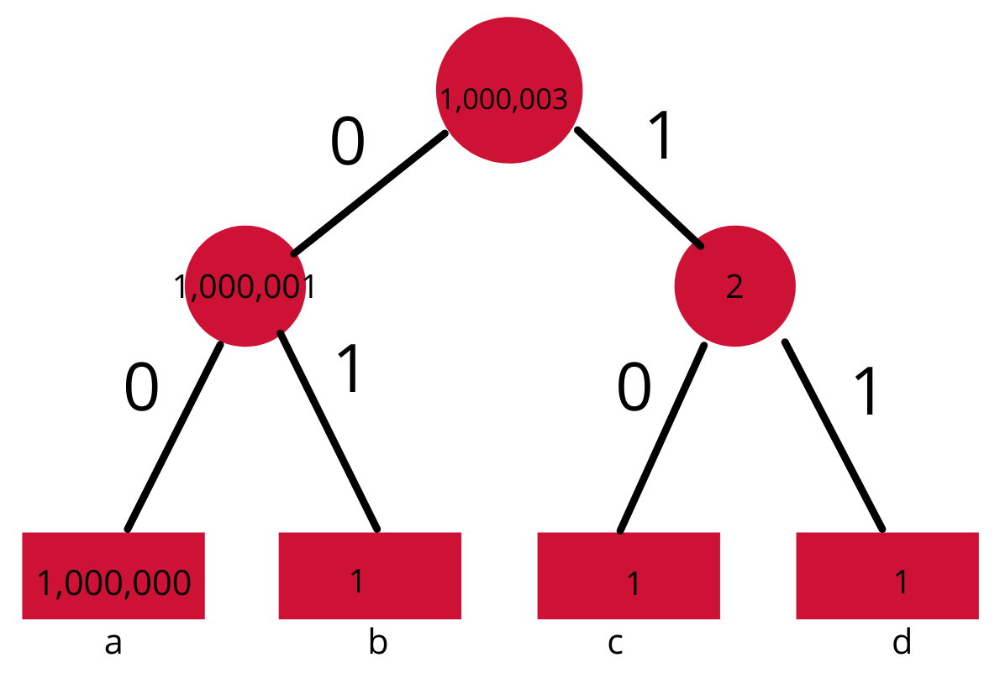
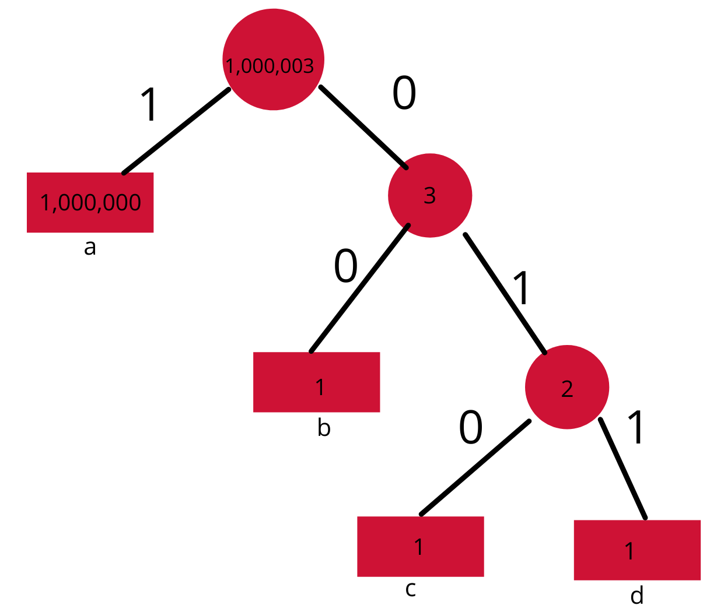
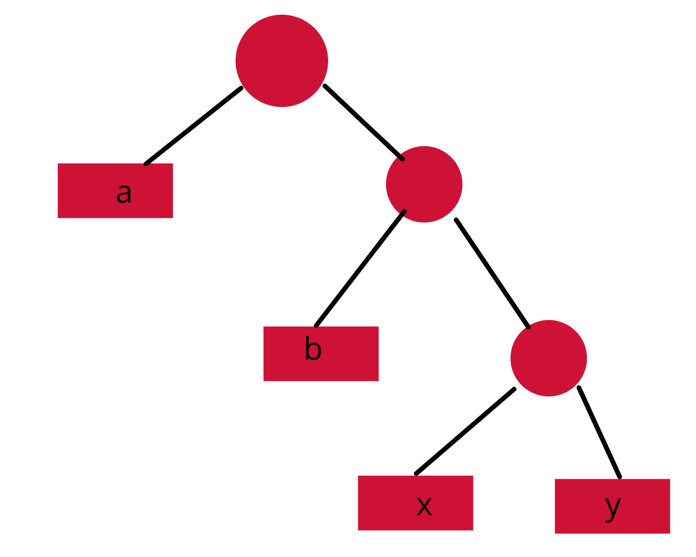
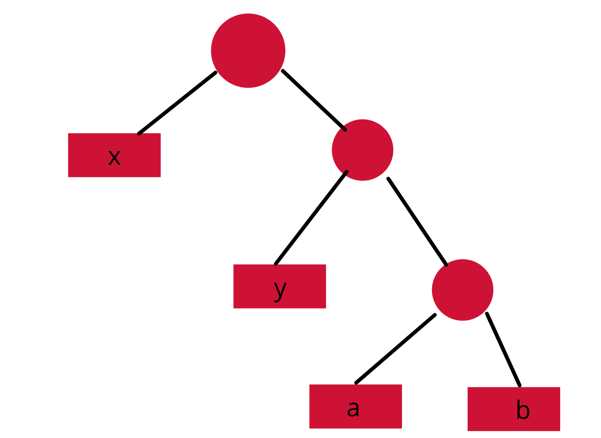
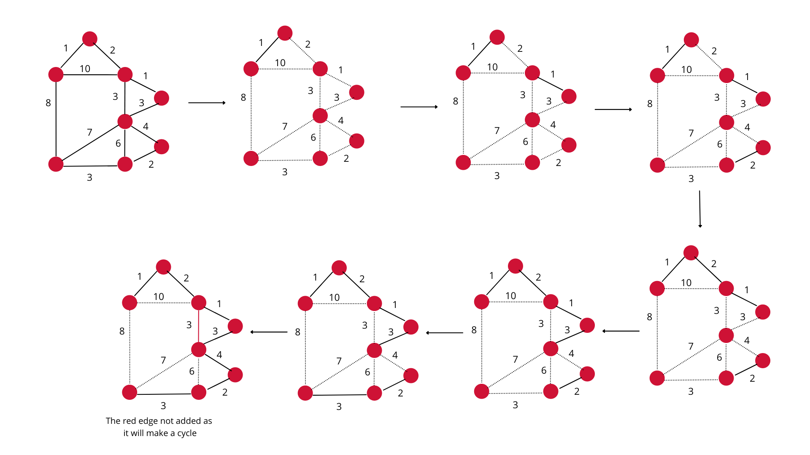

# Chapter 3 - Greedy Algorithms

## Section 3.1 - Introduction

Greedy algorithms works on the principle that we can calculate the optimised answer by following a set of steps such that we calculate a part of the answer at each step. At each step we are gaurenteed to get a part of the answer and can calculate it efficiently. This method will not work on types of problems, but is usually the fastes solution for the problems where it works. 

Therefore, only those problems where local optimality gaurentees global optimality can be solved by greedy algorithms.

## Section 3.2 - Designing a Greedy Algorithm

The following steps are followed to design a greedy algorithm-
* Cast the optimization problem as one in which we make a choice and are left with one subproblem to solve.
* Prove that there is always an optimal solution to the original problem that makes the greedy choice, so that the greedy choice is always safe.
* Demonstrate optimal substructure by showing that, having made the greedy choice, what remains is a subproblem with the property that if we combine an optimal solution to the subproblem with the greedy choice we have made, we arrive at an optimal solution to the original problem.

### Greedy-choice property 
This property means that we can construct a globally optimal solution by making a locally optimal (greedy) choice at each step and then merging or constructing the complete solution from that.

In layman's term - Can we find the first part of the globally optimum solution at this step?

### Optimal substructure 
This property means that the solution to the problem will contain solutions to subproblems of the problem as well. This is important as if this is not present in the problem then we can't use greedy as now we can't break the problem into smaller pieces and solve them.

In layman's term  - Can the problem be broken into pieces?

## Example 1 - Activity selection problem

We have a set of activities each with a start time s_i and a finish time f_i. We want to select a subset of activities from the given set such that we maximise the total number of activities selected and no two activities in the selected subset overlap.
That is if we select two activities a_i and a_j, then s_i >= f_j or s_i <= f_j.

### Optimal substructure property in Activity selection problem:

Let S_i_j denotes the activites that start after a_i finishes and end before a_j starts and A_i_j be the optimum solution of S_i_j. 
Now the optimum solution to S_i_j should also include the optimum solution for a subset of it let's say S_i_k (i< k <j ) as if there is another optimum solution of S_i_k (Say A_i_j') then we can replace  A_i_k with A_i_k' and we will get a better solution to S_i_j.Also since S_i_k and S_k_j are disjoint the selection of A_i_k won't change A_k_j.

### Greedy choice property in Activity selection problem:

At every step if we choose the acticity with the least finish time, we will always get the optimum solution. Let us consider an instance of the problem S_k, wherer activity a_m is the one with the earliest finish time, an A_k be an optimum solution to the problem, where a_j is the activity with the earliest finsih time. If a_j = a_m then we are done, if a_j != a_m then we can replace a_j with a_m and we will get a solution to S_k A_k' which is of equal cardinality. Now we already know that activity problem follows optimum substructure, this means we can recursively find the solution with the least finish time and solve the subproblem and get an optimum solution.

## Example 2 - Huffman encoding

We have a very big file of characters, where the file contains only some characters, we already have the frequency of each character. If we use ascii encoding (or similar encoding with fixed number of bytes for each character) we waste a lot of space. Lets say we have a file of only a,b,c,d if it contains 1 million a's and only 1 b,c,d and we use 2 bits to represent each character we use 2,000,006 bits. If however we us 1 to represent a , 00 to represent b, 010 to represent c and 011 to represent d, we get a file of only 1,000,008 bits. We can decode the file as follows, if the bit is 1 it is an a, if it is 0 we continue till we find a 1 , and depending on the nunber of 0's we can determine the character.

This type of encoding is called prefix codes as no code is a prefix to any other code so that there is no ambiguity in decoding these characters. Now we need to find an optimum way to find these prefix codes for a given set of characters. 

The prefix codes can be represented as a binary tree with the leaf nodes being the characters and the internal nodes being the frequency of all characters below it.

image 1

image 2

The first image shows the tree for fixed length encoding and the secodn image shows the tree for variable length encoding.  Notice how in the second tree there is no node below a leaf node this is essential for decoding (that is we can't have a character with code 10 because then it is ambigous during decoding).

### Greedy choice property for Huffman encoding:

There is always an optimum solution where the two nodes with the least frequencies are sister nodes. This can be understood by the folowing pictures

image 3

image 4

Let a and b be the characters with the least frequencies.
Let us assume that for some case image 3 was the optimum solution, then we can make a solution (image 4) which is atleast as good as image 3. 
This happens because, frequency of is atleast as much as that of b therefore, swapping it with b will either reduce the total number of bits used or reduce it. Similarly for y and a.

This shows greedy choice property as now at each step we can take the two characters with smallest frequencies.

### Optimal substructure property for Huffman encoding:

At each step we can merge two sibling into a new character with the frequency as the sum of these two nodes, create a tree and replace the new node with the two original nodes. This can be proved easily using inductive hypothesis. Therefore, w can break the problen into smaller subproblems and solve them.

The actual algorithm at all steps finds the two nodes with the least frequencies (using priority queue), merges them and adds a new node with the sum of frequencies as the new frequency to the priority queue

## Example - 3 Minimum spanning tree using Kruskal's algorithm

We are given a connected undirected graph and we have to select some edges such that the graph is still connected and 
the sum of all edges is minimum. This will automatically generate a tree as if we add cycles to the graph we will 
unnecessarily increase the toal sum of edges

### Kruskal's algorithm

Sort all edges accroding to their weights and then one by one select the lightest edge and add it to the answer if it doesn't form a cycle. The resulting graph will definetaly be a MST 

Intutive proof
We check all edges to see if it forms a cycle, if not it is in the answer graph. 

    - Proof that the resulting graph is a spanning tree
        Let there be a node a, which is not connected to the graph in the answer, and let E be the optimum edge connecting a to the graph.
        This case would never arise in this algorithm as when we will check the edge E, we will include it in the answer graph as it doesn't 
        form any cycles, as a is not connected to the graph.
    
    - Proof that the resulting spanning tree is minimum
        Let e be an edge in an MST T and e' be an edge in our answer MST T' such that weight(e') < weight(e) and e and e' connect the same 
        forests. Then we can replace e with e'. This will be a tree as now the number of edges is the same and there is no cycle, hence the graph is a tree, moreover the total weight is now reduced, hence our tree is an MST

Dry Run for Kruskal's algorithm

The main difficulty with using the Kruskal's algorithm is the we need an efficient way to find wether adding the 
selected edge will create a cycle in the graph. This can be done using disjoint set union data structure. 
Every node has a parent node. Whenever we have to check an edge we find the king of the start and end node of the 
edge if they are different then no cycle will form and union operation is done else it will form a cycle

Union operation merges the king of two nodes if such an edge is added to the graph.

We will also use path compression to make it even faster. In path compression the parent of a node is updated during 
find operation. 

King is the node which is at the top of the tree. The data structure is initialised with all nodes as kings

## Problems
q1) https://codeforces.com/problemset/problem/253/A

q2) https://codeforces.com/problemset/problem/1139/B

q3) https://codeforces.com/problemset/problem/1428/C