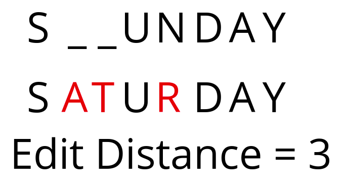

# Chapter 4 - Dynamic programming

## Section 4.1 - Introduction

In dynamic programming, we solve a problem by breaking it into smaller problems and stroing their result to avoid
calculating them again. This can improve the speed of algorithms significantly (in scenarios where it can be used)
We store the optimum solutions in a bottom-up manner and use it every time we need to solv ethat particular subproblem.
Hence dp is especially useful where the same subproblems occur repetedely.

## Section 4.2 - Designing a dynamic programming algorithm

We recursively define the subproblem till we reach a very small subproblem which can't be divided further and calculate it
When we recurse back, we store the results in a table or array and use it whenever we need to solve the same subproblem
We construct the solution to the original problem by combining the solutions to the subproblem from the table

Notice that just like greedy problems, dp problems should also follow optimum substructure property

Dynamic problems should also follow overlapping subproblem property which means that the subproblems should overlap so that the table could be 
used

### Example - Fibonacci Sequence

We can make a recursive solution for calculating Fibonacci numbers, but notice that the subproblems are overlapping, hence if we use an array to 
store the results, we can use it to generate the solution much faster.

The difference in time is huge, for n = 45 the recurssive method take around 6 sec, wheras the dynamic programming method takes around 0.01 sec for n = 100

### Example - Longest Increasing Subsequence

A subsequence of an array is an array generated by deleting some number form it which may or may not be continuous.
We want to find an array of maximum length such that all the elements are in increasing order.

The dp solution -
We have an array which represents the length of the longest increasing subsequence ending at that index.
Next for any index i, we iterate for all elements < a[i] , then LIS[i] = max(LIS[j] + 1, LIS[i])

### Example - Edit Distance

We want to calculate the minimum number of insert, delete or overwrite to convert one mord to another

Example

We start iterating from the end of both the strings and check if the characters are equal then we reduce i and j by 1 and continue.
If the yare different we have 3 choice and we take the minimum of the three
    * Choice 1 - Insert a character in the first string to the right of the current index
        we add one to the answer and iterate by one to the left for the second string
    * Choice 2 - Delete a character in the first string at the current index
        we add one to the answer and iterate by one to the left for the first string
    * Choice 3 - Replace a character in the first string at the current index
        we add 1 to the answer and iterate by one to the left for the first string and the second string
At each step we take the minimum of these 3 steps

str1 ->  i denotes the index (starting from right most) of the first string
str2 ->  j denotes the index (starting from right most) of the second string

We denote res(i,j) as the minimum number of edits required for converting str1[0...i] to str2[0...j]

We basically at each step we do
res(i,j) = min(res(i-1,j) + 1, res(i,j-1) + 1, res(i-1,j-1) + (str1[i] != str2[j]))

### Example - Matrix Chain Multiplication

We are given a sequence of matrix whose product we have to calculate. Now, matrix multiplicaiton follows associativity, hence we can multiply 
them in any order. However, the order we multiply them in makes a huge difference in terms of the number of multiplications we need to do.
Hence we wish to calculate the most optimum way to multiply the matrices.

This can be easily done using dp as follows
dp[i][j]  = min (d[i][j],dp[i][k] + dp[k+1][j] + p[i-1]*p[k]*p[j]) , k = i to j-1
dp[i][j] represents the number of operations required for multiplying the matrices i to j.
We will do this for all length of matrix chain starting form 2 

## Questions
q1) https://codeforces.com/problemset/problem/313/B
q2) https://www.hackerrank.com/contests/moodys-analytics-fall-university-codesprint/challenges/tile-stacking-problem
q3) https://leetcode.com/problems/number-of-dice-rolls-with-target-sum/