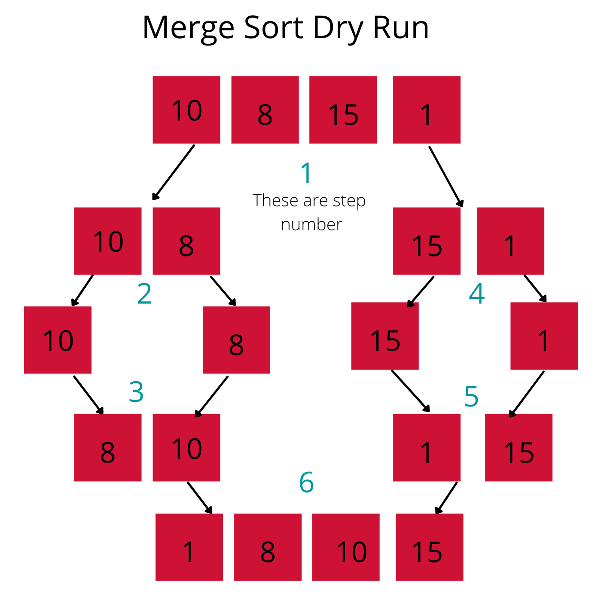

# Chapter 5 - Divide and conquer

## Section 5.1 - Introduction

Divide and conquer is a programming technique in which we first break the problem into smaller subproblems and 
then solve these smaller by in turn dividing them into even smaller pieces and so on. When the problems are very 
small (base case) we directly solve them. Then we combine these results to solve   the bigger problem and so on.

In Divide and conquer algorithms the problem must be such that it can be broken into smaller subproblems which are easier to compute.

## Time complexity in Divide and Conquer

Let for each step T(n) = aT(n/b) + O(n^d), then time complexity for such a problem is 

 O(n ^ d ) , if d > log b (a)

O(n^d * log n), if d  = log b (a)

O(nlog ba) , if d < log b (a)

## Exmalpes

### Example - Merge Sort

In merge sort we divide the array into smaller and smaller parts till the length is only 1 
after which we start merging them. This is easier because the two arrays to be merged and hence when we merge 
them we will get an array that is already sorted.

#### Dry Run for Merger sort

### Example - Karatsuba Multiplicaiton

Normal multiplication (like we do by hand) is not very efficient and is of time complexity O(n^2).
We can use Karatsuba multiplication to make it more efficient.

Let us represent the numbers like this 
X  = Xl * 2^n/2 + Xr
Y =  Yl * 2^n/2 + Yr 
that is representing the number as sum of two parts

Now, 
X * Y   =  (Xl * 2^n/2 + Xr) * (Yl * 2^n/2 + Yr )
        =  Xl * Yl * 2^n + 2^n/2 * (Xl * Yr + Xr * Yl) + Xr + Yr

This shows we need 4 multiplicaitons for each stage, and number of stages would be log (n) so time complexity is 4 ^ log(n) = n ^ 2
which is of the same order as normal multiplicaiton, but we can do this computation by just three multiplicaitons as follows

Multiplicaiton 1 = Xl * Yl
Multiplicaiton 2 = Xr * Yr
Multiplicaiton 3 = (Xl + Xr) * (Yl + Yr) - (Multiplicaiton 1 + Multiplicaiton 2)

This will mean 3 multiplications per stage so overall time complexity becomes 3 ^ log(n) = n ^ 1.59

Note - Here we have discussed the case where the numbers are in binary. 

### Example - Strassen's Matrix multiplication

Matrix multiplicaiton is  a very time consuming process. Naive algorithm will take O(n3) time for multipling 2 n X n matrices.
The idea of Strassen's algorithm is very similar to Karatsuba multiplication, we divide the matrix into 4 quadrants and multiplying them in a way to get the final matrix in 7 opertions instead of the naive 8 operations giving us a time complexity of O(nlog 7)

### Questions 
q1) https://codeforces.com/problemset/problem/1490/D
q2) https://codeforces.com/problemset/problem/1385/D
